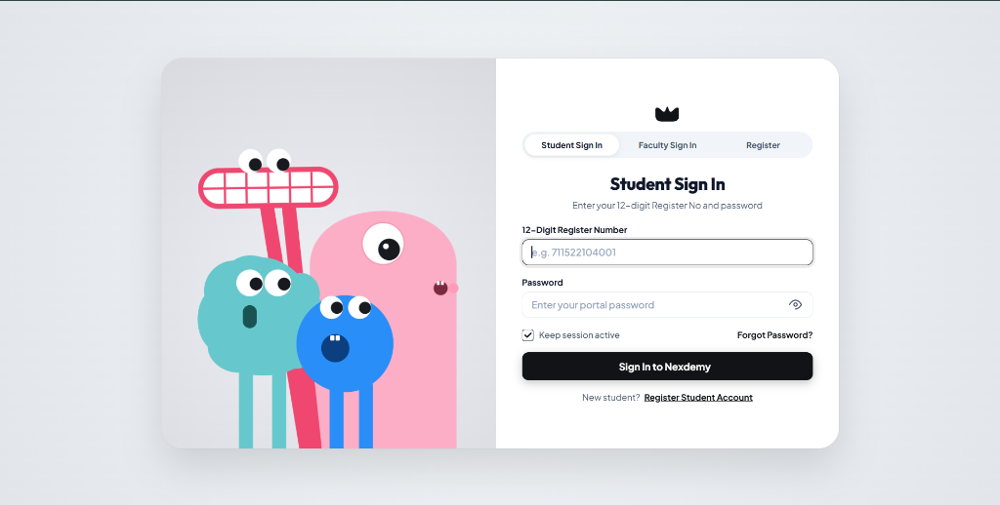
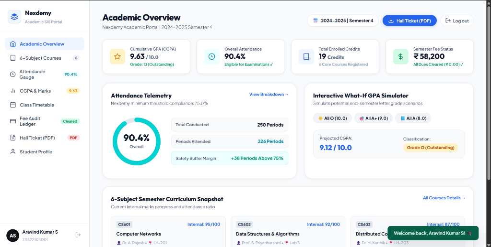
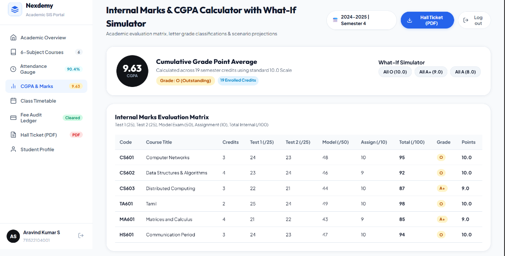
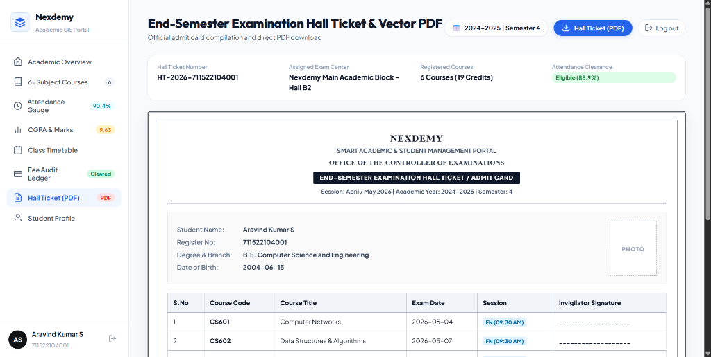
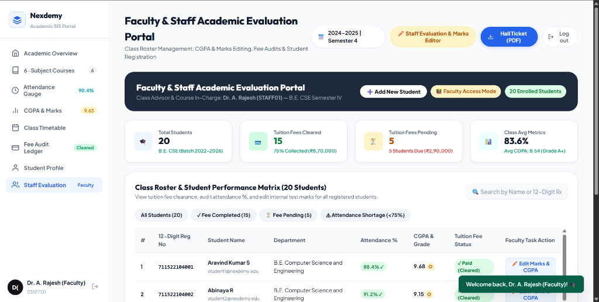

# Web Sprint 2026 — Hackathon

> **Web Sprint 2026 — Hackathon of the 3 hour hackathon participated and selected for 2nd round, in V.S.B Engineering College, Karur.**

---

# Nexdemy — Smart Academic & Student Information System (SIS) Portal

**Nexdemy** is an enterprise-grade, full-stack Academic Student Information System (SIS) and Institutional Management Portal built with modern vanilla web technologies, Python backend services, and MySQL persistence. It features custom 60 FPS interactive monster character animations, strict role-based access control (Student vs Faculty), live Gmail SMTP OTP password reset, real-time attendance compliance telemetry, What-If CGPA simulations, single-page vector PDF fee receipts, and faculty evaluation management.

---

## 📸 System Screenshots & Interface Showcase

### 1. Interactive Animated Monster Login Portal & Tab-Locked Authentication

*Sequential drop entrance animation, cursor tracking pupil physics, password privacy blindfold mode, role-segregated authentication tabs (Student / Faculty / Register), and Gmail SMTP OTP recovery.*

---

### 2. Academic Overview & Real-Time Attendance Compliance Telemetry

*Live circular SVG telemetry gauge with 75.0% regulatory threshold tracking, safety margin buffer calculation, 6-subject academic curriculum snapshot, and quick stat metrics.*

---

### 3. Internal Marks & Cumulative Grade Point Average (CGPA) Calculator with What-If Simulator

*6-subject internal assessment matrix (Test 1, Test 2, Model Exam, Assignment), standard 10.0 CGPA calculation engine, and instant What-If end-semester letter grade scenario projection chips.*

---

### 4. Official End-Semester Examination Hall Ticket & Vector PDF Generator

*Office of the Controller of Examinations official admit card with candidate metadata, 6-course examination schedule, institutional security seals, and direct client-side vector PDF download.*

---

### 5. Faculty & Staff Academic Evaluation Portal & Class Roster Management

*Class roster management with dynamic filters (All, Fee Cleared, Fee Pending, Shortage), inline CGPA & Marks editing, tuition fee audit status updates, and dynamic student registration.*

---

## 🚀 Key Features & Architectural Modules

### 🎨 1. Interactive 60 FPS Monster Physics Canvas Engine
- **Sequential Drop Physics**: Sky-blue monster descends from above, pink and dark blue monsters slide in from below, and the tall red monster enters last with custom easing curves.
- **Pupil & Eye-Tracking Telemetry**: All 4 characters continuously track the user's cursor across the viewport in real-time.
- **Password Privacy Mode**: When focusing on password inputs or toggling visibility, characters close their eyes and cover their gaze until input focus is cleared.
- **Red Monster Jaw & Teeth Animation**: Dynamic 3-second periodic opening and closing mouth/teeth articulation.

### 🔐 2. Role-Segregated Authentication & Gmail SMTP OTP Engine
- **Strict Tab Enforcement**: Dedicated login modes prevent student accounts from accessing faculty tabs and vice versa.
- **Live Gmail SMTP Integration**: Integrated with `postmanmail21@gmail.com` using TLS on port 587. Generates cryptographically secure 6-digit OTP codes for password resets.
- **SHA-256 Password Hashing**: Passwords stored securely in MySQL `nexdemy_db.users` with unique application salt.

### 📊 3. Academic Telemetry & Attendance Regulatory Gauge
- **Compliance Gauge**: Circular SVG progress gauge monitoring attendance against the mandatory 75.0% institutional threshold.
- **Safety Margin Telemetry**: Calculates exact periods buffer (+38 periods above 75%) or shortage warnings for condonation.
- **Role-Aware Class Aggregates**: When Faculty signs in, the Attendance, Marks, and Fee Audit sections automatically calculate and display class-wide averages across all enrolled students.

### 🎯 4. 6-Subject Internal Marks Matrix & What-If GPA Simulator
- **Standard 10.0 CGPA Engine**: Computes semester weighted GPA across 19 credit hours.
- **Evaluation Breakdown**: Detailed marks recording for Test 1 (25), Test 2 (25), Model Exam (50), Assignment (10), and Internal Total (100).
- **Interactive What-If Simulator**: Allows students to simulate projected CGPA under *All O (10.0)*, *All A+ (9.0)*, and *All A (8.0)* scenarios.

### 📄 5. Single-Page Official Electronic Fee Receipt & PDF Audit Ledger
- **Single-Page Institutional Format**: Formatted fee receipt complete with College Name (*KS College of Engineering, Karur - 639001*), transaction metadata, and amount in words in Indian Rupees (INR).
- **Dual Institutional Verification Seals**: Features the authentic Nexdemy Academic Seal and Accounts Department Finance Officer Seal.
- **Vector PDF & Print Support**: Direct high-resolution PDF download using client-side vector rendering or browser print styling.

### 🎓 6. Controller of Examinations Hall Ticket (Student Exclusive)
- **Official Admit Card**: Candidate profile, 12-digit register number, photo placeholder, venue allocation, and full course examination timetable.
- **Role-Restricted Navigation**: Exclusively accessible to students; automatically hidden from faculty login navigation.

### 👨‍🏫 7. Faculty Suite & Dynamic Student Enrollment
- **Comprehensive Roster Management**: Quick filter chips for *All Students*, *Fee Completed*, *Fee Pending*, and *Attendance Shortage (<75%)*.
- **Live Evaluation Editor**: Faculty can modify student CGPA (0.00–10.00), attendance %, 6-subject internal scores, and tuition fee clearance status in real-time.
- **Add New Student Modal**: Faculty can dynamically enroll new students with validated 12-digit register numbers into the MySQL database.

---

## 🛠️ Technology Stack

| Layer | Technologies Used |
| :--- | :--- |
| **Frontend** | HTML5 Semantic Markup, CSS3 Modern Variables & Flexbox/Grid, Vanilla JavaScript (ES6+), HTML5 Canvas 2D Physics Engine |
| **PDF Generation** | jsPDF Vector Engine (Client-Side Vector PDF Rendering) |
| **Backend** | Python 3.13, Native HTTP REST Engine / WSGI, PyMySQL Driver |
| **Database** | MySQL Server (Database: `nexdemy_db`, Port: 3306) |
| **Mailing / SMTP** | Gmail SMTP Server (`smtp.gmail.com:587`, TLS Authentication) |

---

## 🔑 Default Credentials

| Role | Username / Identifier | Password | Access Scope |
| :--- | :--- | :--- | :--- |
| **Student** | `711522104001` | `Student@2026` | Academic Overview, 6-Subject Attendance, Marks & CGPA, Timetable, Fee Receipt, Hall Ticket PDF |
| **Faculty** | `STAFF01` | `Staff@2026` | Class Average Telemetry, Marks & CGPA Evaluation, Fee Collection Audit, Add New Student |

---

## 🚀 Getting Started

### 1. Database Setup
Ensure MySQL is running on port 3306 with credentials `root` / `2006`:
```sql
CREATE DATABASE IF NOT EXISTS nexdemy_db CHARACTER SET utf8mb4;
```

### 2. Start the Application Server
```bash
python run.py
```
The server will automatically initialize tables in `nexdemy_db`, seed the default accounts, and launch the portal on `http://localhost:8080`.
